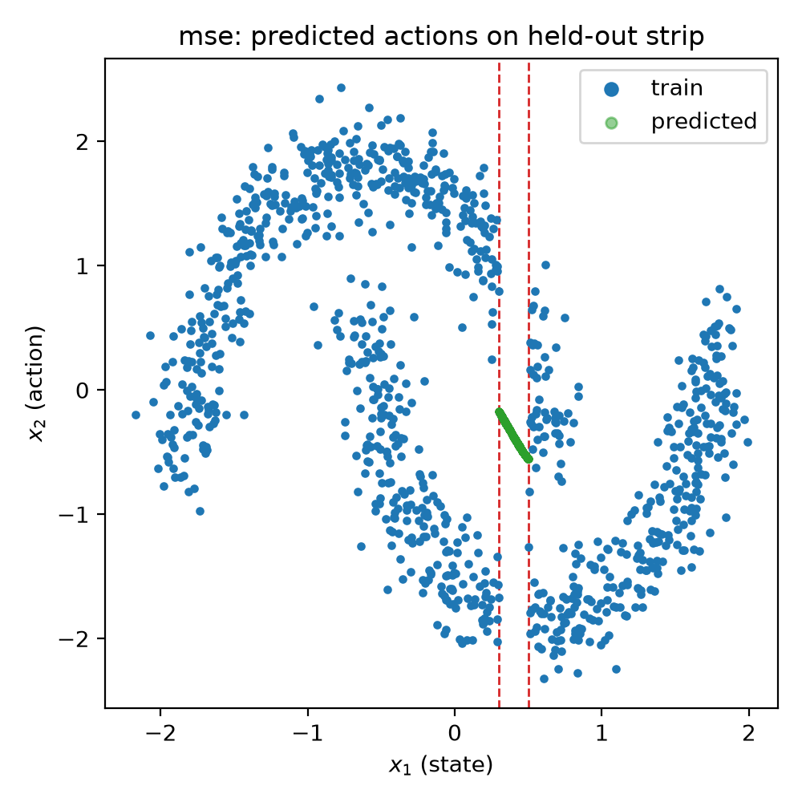
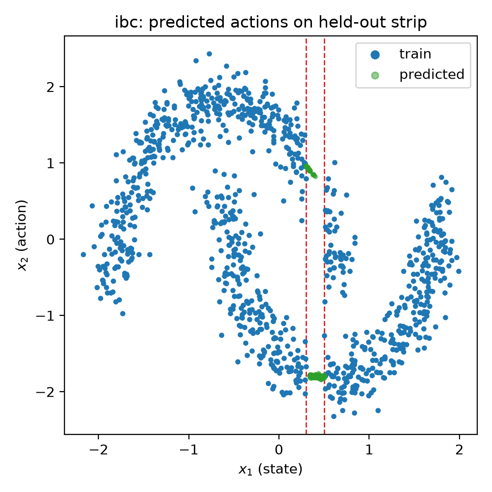
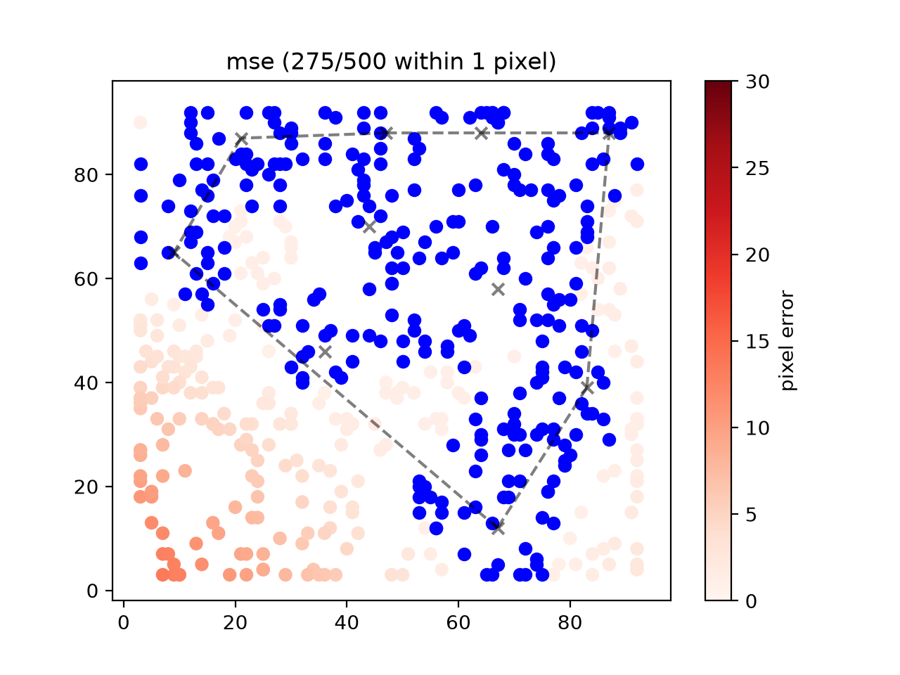
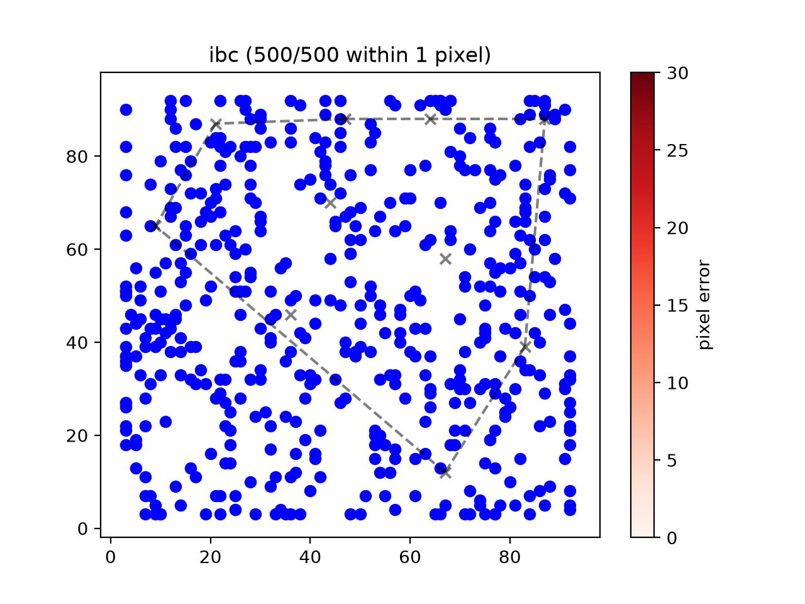
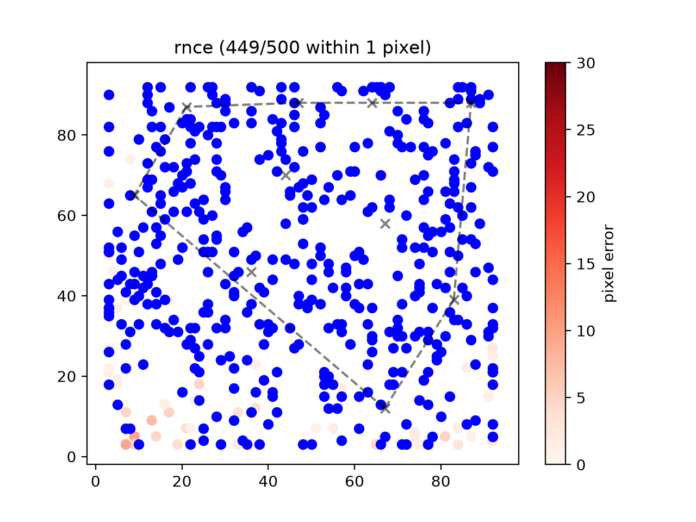
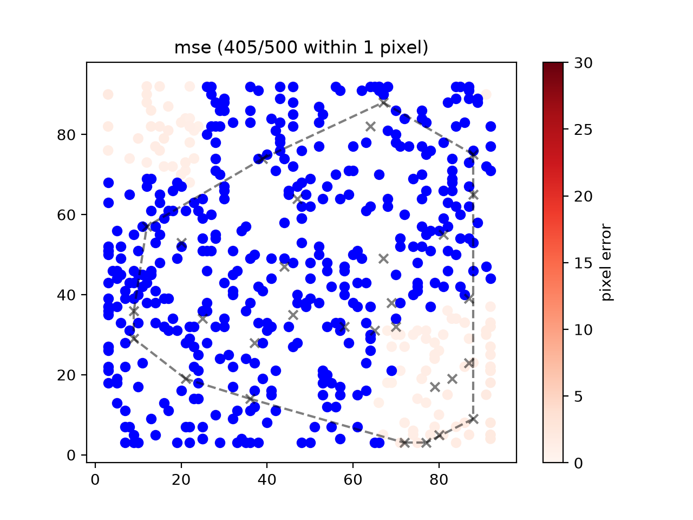
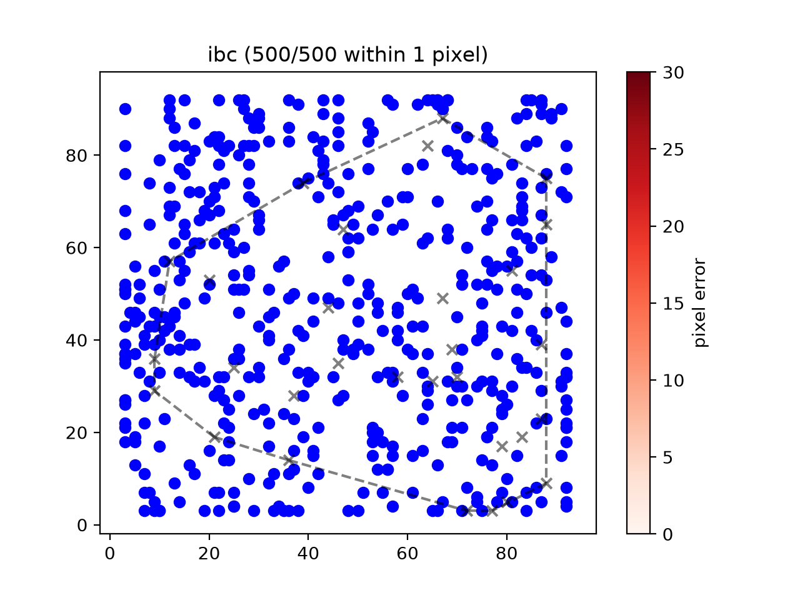
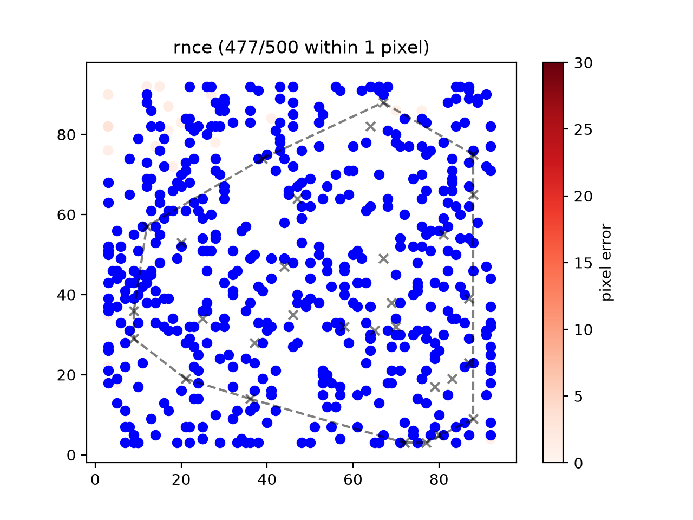
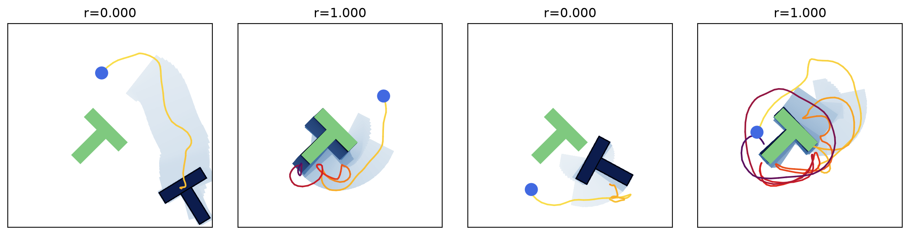
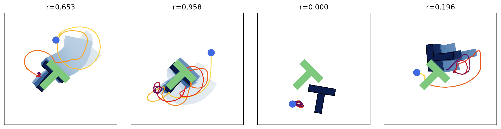

# Energy-Based Policies

A PyTorch implementation for energy-based policies. Implements [Ranking Noise Contrastive Estimation](https://arxiv.org/abs/2309.05803) and [Implicit Behavior Cloning](https://arxiv.org/abs/2109.00137).

Energy-based policies are learned from an imitation learning setting and compared to an MSE loss baseline. 

Notation:
- MSE: Mean Square Error
- IBC: Implicit Behavior Cloning / InfoNCE Loss
- RNCE: Ranking Noise Contrastive Estimation

## Getting Started

Clone the environment and change directories. The following uses cloning via ssh:

```bash
git clone git@github.com:mht3/ebp.git
cd ebp
```

### Environment Setup

Create a new conda environment with Python 3.12.
```bash
conda create -n energy python=3.12
```

Activate the environment.
```sh
conda activate energy
```

Install torch

<details>
<summary>PyTorch on GPU</summary>
<br>
Install a CUDA enabled PyTorch that matches your system architecture.
  
```sh
pip install -U torch==2.7.0 torchvision==0.22.0 --index-url https://download.pytorch.org/whl/cu128
```
</details>

<details>
<summary>PyTorch on CPU Only</summary>
<br>
Alternatively, install PyTorch on the CPU.
  
```sh
pip install torch==2.7.0 torchvision==0.22.0 --index-url https://download.pytorch.org/whl/cpu
```
</details>


Install the package and its dependencies in editable mode.

```sh
pip install -e ".[dev]"
```

Run the tests to make sure the codebase is setup properly. If all tests pass, you're good to go!

```sh
pytest tests/
```

## Results

### Moons Dataset

| MSE | IBC | R-NCE |
|-----------------|-----------------|-----------------|
||| |


### 2D Coordinate Regression

|             | MSE | IBC | R-NCE |
|-------------|-----------------|-----------------|-----------------| 
| 10 examples ||| |
| 30 examples ||| |


### Push-T

Policy rollouts on the Push-T task. The **Multimodal** row overlays several short rollouts from a single symmetric initial condition (the agent can pass the block on either side), and the **Rollout** row shows one full rollout in each of four initial conditions. In both, the moving block is color coded by time (lightest at the start, darkest at the end), the pusher path uses a yellow-to-purple heatmap, and the goal configuration is filled green.

|            | MSE | IBC | R-NCE |
|------------|-----------------|-----------------|-----------------|
| Multimodal ||| |
| Rollout    ||| |

Score is the mean episode score over 20 random initial conditions x 32 rollouts, where each episode's score is the maximum over time of `s = min(coverage / 0.95, 1)` (coverage = block-goal intersection area / block area).

|       | MSE | IBC | R-NCE |
|-------|-----|-----|-------|
| Score | 0.306 +/- 0.340 | 0.459 +/- 0.351 |       |


## Training

To reproduce the results you see, simply run the shell scripts below.

### 2D Coordinate Regression

Train EBMs with MSE, IBC and R-NCE losses for the coordinate regression task and use Langevin MCMC sampling at inference time.

```sh
bash scripts/generate_coordinate_regression_dataset.sh
```


```sh
bash scripts/train_coordinate_regression.sh
```

The dataset will be saved under `datasets/`, and three separate torch models will be saved in `models/` after training. Results will be printed after running the shell script and images will be saved in `assets/`.

### Push-T

Download [Diffusion Policy](https://diffusion-policy.cs.columbia.edu)'s Push-T demonstrations (206 human teleop episodes, ~100MB zip) and convert them to train/test `.npz` files under `datasets/`.

```sh
bash scripts/generate_push_t_dataset.sh
```

Train MSE and IBC policies, then roll each one out in four initial conditions; time-shaded rollout plots and a multimodal-behavior figure (many short rollouts overlaid from a symmetric initial condition, where the agent must pass the block on either side) are saved to `images/`.

```sh
bash scripts/train_push_t.sh
```

Try the task yourself with the mouse via `python ebp/tasks/pusht/demo_push_t.py`. Nothing is saved unless you pass `--record datasets/push_t_teleop.npz`, which appends your demonstrations to a training-ready `.npz`.

### Moons Dataset

Generate the two-moons train set (excluding the held-out strip) and test set (only the strip) under `datasets/`.

```sh
bash scripts/generate_make_moons_dataset.sh
```

Train MSE and IBC and plot each model's predicted actions over the held-out strip (plus the IBC energy landscape) to `images/`.

```sh
bash scripts/train_make_moons.sh
```

## Citation

If you find this code useful, consider citing:

```bibtex
@software{taylor2026ebp,
    author = {Taylor, Matthew},
    month = {7},
    title = {{Energy-Based Policies}},
    url = {[https://github.com/kevinzakka/ibc](https://github.com/mht3/ebp)},
    version = {0.0.1},
    year = {2026}
}
```

Thanks to the following works for help with this codebase!


For IBC training details and the coordinate regression task:

```bibtex
@misc{florence2021implicit,
    title = {Implicit Behavioral Cloning},
    author = {Pete Florence and Corey Lynch and Andy Zeng and Oscar Ramirez and Ayzaan Wahid and Laura Downs and Adrian Wong and Johnny Lee and Igor Mordatch and Jonathan Tompson},
    year = {2021},
    eprint = {2109.00137},
    archivePrefix = {arXiv},
    primaryClass = {cs.RO}
}
```

For R-NCE training details and comparisons to IBC:

```bibtex
@misc{singh2023revisitingenergybasedmodels,
      title={Revisiting Energy Based Models as Policies: Ranking Noise Contrastive Estimation and Interpolating Energy Models}, 
      author={Sumeet Singh and Stephen Tu and Vikas Sindhwani},
      year={2023},
      eprint={2309.05803},
      archivePrefix={arXiv},
      primaryClass={cs.RO},
      url={https://arxiv.org/abs/2309.05803}, 
}
```

For the PyTorch implementation of IBC along with the coordinate regression PyTorch dataloader:

```bibtex
@software{zakka2021ibc,
    author = {Zakka, Kevin},
    month = {10},
    title = {{A PyTorch Implementation of Implicit Behavioral Cloning}},
    url = {https://github.com/kevinzakka/ibc},
    version = {0.0.1},
    year = {2021}
}
```