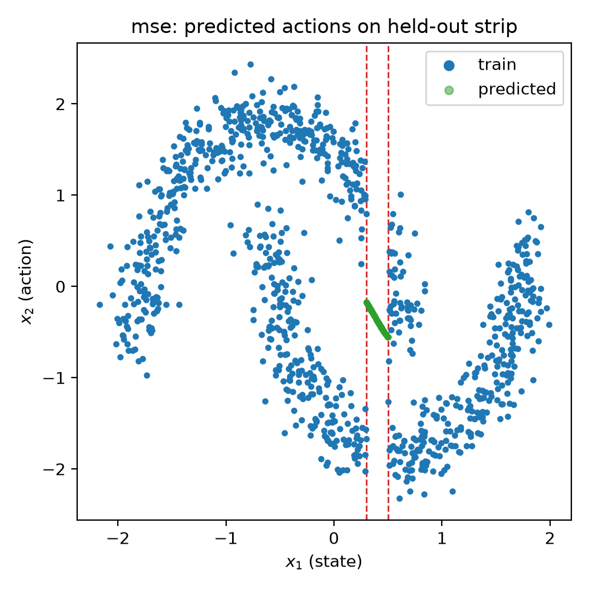
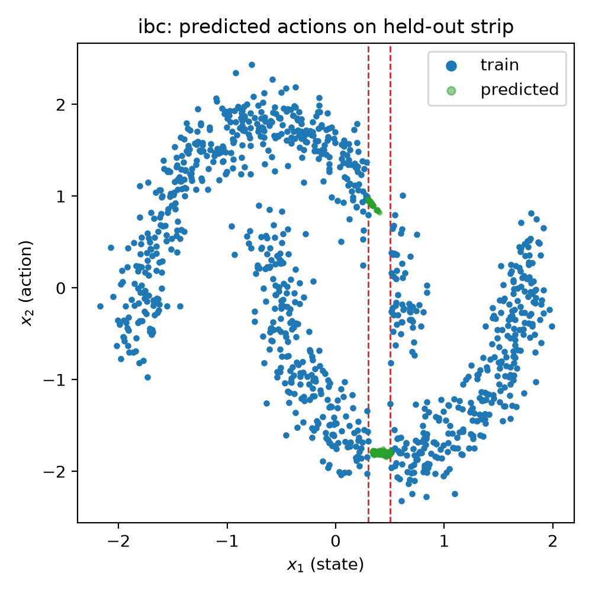
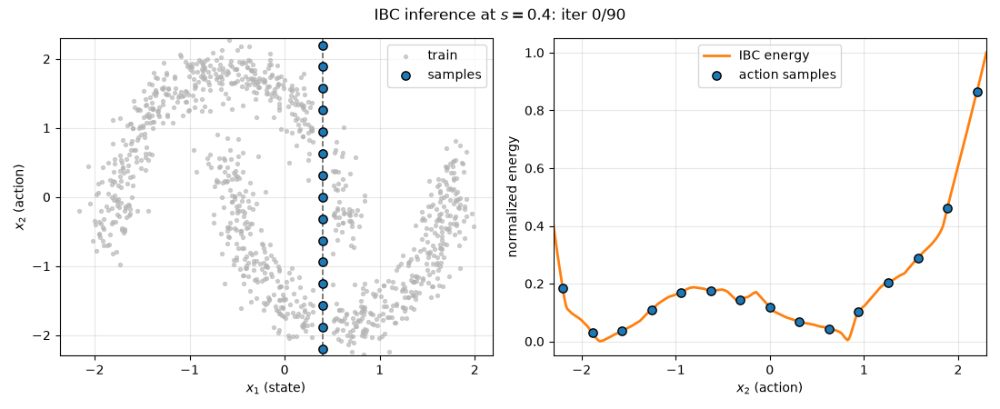
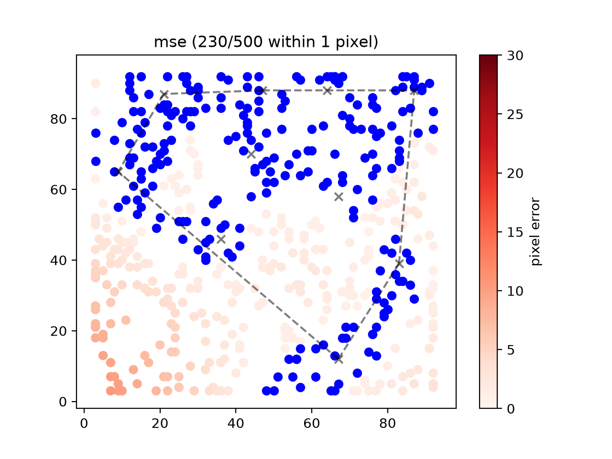
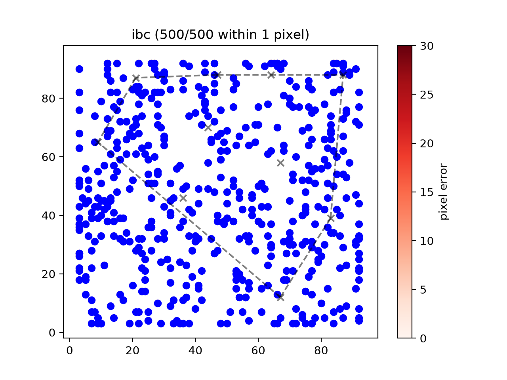
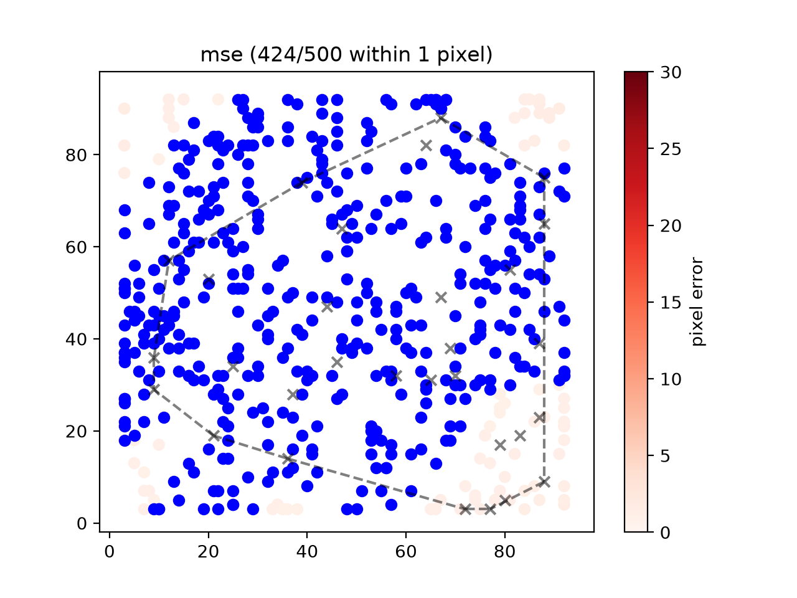
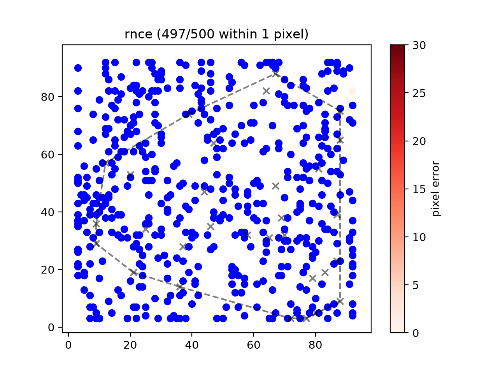
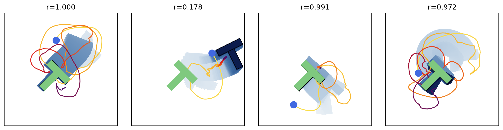
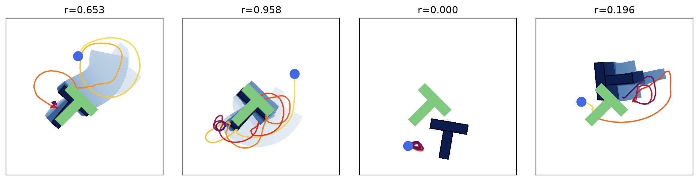
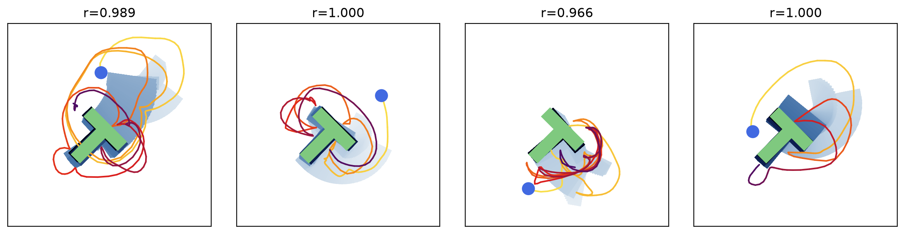

# Energy-Based Policies

A PyTorch implementation for energy-based policies. Implements [Ranking Noise Contrastive Estimation](https://arxiv.org/abs/2309.05803) and [Implicit Behavior Cloning](https://arxiv.org/abs/2109.00137).

Energy-based policies are learned from an imitation learning setting and compared to an MSE loss baseline. 

Notation:
- MSE: Mean Square Error
- IBC: Implicit Behavior Cloning / InfoNCE Loss
- RNCE: Ranking Noise Contrastive Estimation

## Getting Started

Clone the environment and change directories. The following uses cloning via ssh:

```bash
git clone git@github.com:mht3/ebp.git
cd ebp
```

### Environment Setup

Create a new conda environment with Python 3.12.
```bash
conda create -n energy python=3.12
```

Activate the environment.
```sh
conda activate energy
```

Install torch

<details>
<summary>PyTorch on GPU</summary>
<br>
Install a CUDA enabled PyTorch that matches your system architecture.
  
```sh
pip install -U torch==2.7.0 torchvision==0.22.0 --index-url https://download.pytorch.org/whl/cu128
```
</details>

<details>
<summary>PyTorch on CPU Only</summary>
<br>
Alternatively, install PyTorch on the CPU.
  
```sh
pip install torch==2.7.0 torchvision==0.22.0 --index-url https://download.pytorch.org/whl/cpu
```
</details>


Install the package and its dependencies in editable mode.

```sh
pip install -e ".[dev]"
```

Run the tests to make sure the codebase is setup properly. If all tests pass, you're good to go!

```sh
pytest tests/
```

## Results

### Moons Dataset

| MSE | IBC | R-NCE |
|-----------------|-----------------|-----------------|
||| |

IBC inference as energy descent: from uniform action samples at a fixed state $s = 0.4$, gradient-based MCMC on the learned energy drives the samples onto both moons — the two valid actions a single-mode regressor cannot represent. Left: the $(s, a)$ plane (training data in gray); right: the energy slice at $s = 0.4$.




### 2D Coordinate Regression

|             | MSE | IBC | R-NCE |
|-------------|-----------------|-----------------|-----------------| 
| 10 examples ||| |
| 30 examples ||| |


### Push-T

Policy rollouts on the Push-T task. Moving block is color coded by time (lightest at the start, darkest at the end), the pusher path uses a yellow-to-purple heatmap, and the goal configuration is filled green.

|            | MSE | IBC | R-NCE |
|------------|-----------------|-----------------|-----------------|
| Multimodal ||||
| Rollout    ||||

Score is the mean episode score over 256 random initial conditions, where each episode's score is the maximum over time of `s = min(coverage / 0.95, 1)` (coverage = block-goal intersection area / block area). Reported as mean $\pm$ a 95% confidence interval (normal approximation), following Singh et al.

$T_p$ is the number of actions predicted per step and $T_a$ the number executed before replanning.

|                    | MSE | IBC | R-NCE |
|--------------------|-----|-----|-------|
| $T_p=1,\ T_a=1$    | $0.246 \pm 0.039$ | $0.570 \pm 0.044$ | $0.643 \pm 0.044$ |
| $T_p=2,\ T_a=2$    | $0.478 \pm 0.056$ | $0.237 \pm 0.025$ | $\mathbf{0.772 \pm 0.041}$ |
| $T_p=4,\ T_a=4$    | $0.667 \pm 0.052$ | $0.169 \pm 0.024$ | $0.613 \pm 0.049$ |
| $T_p=16,\ T_a=8$   | $0.632 \pm 0.054$ | $0.149 \pm 0.022$ | $0.530 \pm 0.042$ |


IBC performs poorly when using action chunking because uniform negatives don't fall near the action data manifold. 


## Training

To reproduce the results you see, simply run the shell scripts below.

### 2D Coordinate Regression

Train EBMs with MSE, IBC and R-NCE losses for the coordinate regression task and use Langevin MCMC sampling at inference time.

```sh
bash scripts/generate_coordinate_regression_dataset.sh
```


```sh
bash scripts/train_coordinate_regression.sh
```

The dataset will be saved under `datasets/`, and three separate torch models will be saved in `models/` after training. Results will be printed after running the shell script and images will be saved in `images/`.

### Push-T

Download [Diffusion Policy](https://diffusion-policy.cs.columbia.edu)'s Push-T demonstrations (206 human teleop episodes, ~100MB zip) and convert them to train/test `.npz` files under `datasets/`.

```sh
bash scripts/generate_push_t_dataset.sh
```

```sh
bash scripts/train_push_t.sh
```

Try the task yourself with the mouse via `python ebp/tasks/pusht/demo_push_t.py`. Nothing is saved unless you pass `--record datasets/push_t_teleop.npz`, which saves the demos to an `.npz`.

### Moons Dataset

Generate the two-moons train set (excluding the held-out strip) and test set under `datasets/`.

```sh
bash scripts/generate_make_moons_dataset.sh
```

```sh
bash scripts/train_make_moons.sh
```

## Citation

If you find this code useful, consider citing:

```bibtex
@software{taylor2026ebp,
    author = {Taylor, Matthew},
    month = {7},
    title = {{Energy-Based Policies}},
    url = {[https://github.com/kevinzakka/ibc](https://github.com/mht3/ebp)},
    version = {0.0.1},
    year = {2026}
}
```

Thanks to the following works for help with this codebase!


For IBC training details and the coordinate regression task:

```bibtex
@misc{florence2021implicit,
    title = {Implicit Behavioral Cloning},
    author = {Pete Florence and Corey Lynch and Andy Zeng and Oscar Ramirez and Ayzaan Wahid and Laura Downs and Adrian Wong and Johnny Lee and Igor Mordatch and Jonathan Tompson},
    year = {2021},
    eprint = {2109.00137},
    archivePrefix = {arXiv},
    primaryClass = {cs.RO}
}
```

For R-NCE training details and comparisons to IBC:

```bibtex
@misc{singh2023revisitingenergybasedmodels,
      title={Revisiting Energy Based Models as Policies: Ranking Noise Contrastive Estimation and Interpolating Energy Models}, 
      author={Sumeet Singh and Stephen Tu and Vikas Sindhwani},
      year={2023},
      eprint={2309.05803},
      archivePrefix={arXiv},
      primaryClass={cs.RO},
      url={https://arxiv.org/abs/2309.05803}, 
}
```

For the PyTorch implementation of IBC along with the coordinate regression PyTorch dataloader:

```bibtex
@software{zakka2021ibc,
    author = {Zakka, Kevin},
    month = {10},
    title = {{A PyTorch Implementation of Implicit Behavioral Cloning}},
    url = {https://github.com/kevinzakka/ibc},
    version = {0.0.1},
    year = {2021}
}
```
